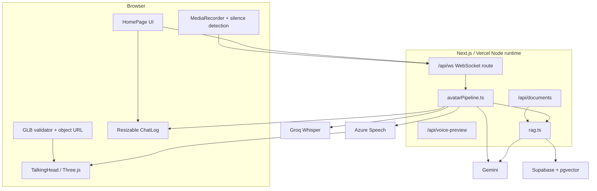

# PITB 3D Talking Avatar Assistant — Complete Project Documentation

**Documentation status:** Current through July 29, 2026
**Production URL:** [https://avatar-chatbot-psi.vercel.app](https://avatar-chatbot-psi.vercel.app)
**Active development branch:** `development`
**Primary production platform:** Vercel
**Primary implementation:** Next.js/Node under `frontend/`

---

## Table of contents

1. [Executive summary](#1-executive-summary)
2. [Project goals and evolution](#2-project-goals-and-evolution)
3. [Chronological development journey](#3-chronological-development-journey)
4. [Final feature set](#4-final-feature-set)
5. [Current system architecture](#5-current-system-architecture)
6. [Frontend implementation](#6-frontend-implementation)
7. [Backend and AI pipeline](#7-backend-and-ai-pipeline)
8. [Avatar compatibility and lip-sync](#8-avatar-compatibility-and-lip-sync)
9. [Voice system](#9-voice-system)
10. [Document knowledge and RAG](#10-document-knowledge-and-rag)
11. [Conversation memory status](#11-conversation-memory-status)
12. [WebSocket protocol](#12-websocket-protocol)
13. [Local development setup](#13-local-development-setup)
14. [Production deployment](#14-production-deployment)
15. [Testing and verification](#15-testing-and-verification)
16. [Problems encountered and solutions](#16-problems-encountered-and-solutions)
17. [Security and privacy](#17-security-and-privacy)
18. [Known limitations](#18-known-limitations)
19. [Recommended future upgrades](#19-recommended-future-upgrades)
20. [Repository and file reference](#20-repository-and-file-reference)
21. [Maintenance and future documentation template](#21-maintenance-and-future-documentation-template)

---

## 1. Executive summary

This project is a browser-based conversational 3D avatar. A user uploads a compatible GLB avatar, selects one of three voices, optionally configures an instruction and uploads knowledge documents, then asks questions through text or microphone.

The current production flow is:

1. The browser validates and renders the user-selected GLB.
2. Typed text or recorded audio is sent through a WebSocket.
3. Groq Whisper transcribes recorded audio.
4. Relevant uploaded-document context is retrieved when available.
5. Gemini generates a concise spoken response.
6. Microsoft Azure Speech creates 24 kHz audio and exact timed viseme events.
7. The browser schedules the PCM audio and Oculus mouth shapes together.
8. TalkingHead/Three.js animates the avatar while the response is displayed in chat.

The application is deployed on Vercel and uses Supabase/pgvector for production document storage.

### Final product screenshots


---

## 2. Project goals and evolution

### Original objective

The project began as a PITB internship deliverable: build an AI chatbot represented by a speaking 3D avatar. The avatar needed to:

- accept typed and voice questions,
- generate useful AI answers,
- speak those answers aloud,
- animate its mouth in synchronization with speech,
- run in a browser,
- keep provider credentials out of client-side code,
- and be deployable for demonstrations.

### First implementation direction

The first production structure used:

- a Next.js/React frontend,
- a separately hosted speech/AI server,
- Render for persistent WebSocket/backend experiments,
- Gemini for responses,
- Groq Whisper for transcription,
- Azure Speech for voice and viseme data,
- and TalkingHead/Three.js for the avatar.

### Upgraded product direction

The project later evolved from a fixed-avatar demonstration into a user-configurable product:

- no default avatar,
- user-provided GLB files,
- compatibility validation before rendering,
- three voice options with previews,
- exact Azure visemes,
- local and production document storage,
- system instructions,
- and a resizable chat-first interface.

The production pipeline is now hosted through the Vercel-linked Next.js project, while the FastAPI backend remains in the repository as an alternative implementation and historical reference.

---

## 3. Chronological development journey

This section records the project from the first tracked deployment through the current release.

### Phase 1 — Initial talking-avatar deployment

**Tracked milestone:** `c48992d` — Initial avatar chatbot deployment

The first version established the basic browser experience:

- Next.js application shell,
- 3D avatar rendering,
- text and microphone interaction,
- AI response generation,
- speech playback,
- and initial mouth animation.

The first goal was functional end-to-end communication, not yet a generalized avatar-upload product.

### Phase 2 — Persistent Render speech server

**Tracked milestone:** `0d84635` — Add persistent Render speech server

The speech pipeline needed a long-lived WebSocket host. A custom Node server was introduced for Render so it could:

- serve health information,
- upgrade `/api/ws`,
- serialize turns per WebSocket connection,
- and forward STT, AI, audio, and viseme events.

### Phase 3 — Render runtime and module fixes

**Tracked milestones:**

- `6f9b534` — Fix Render ESM pipeline import
- `f3b1140` — Fix Render speech pipeline runtime loading

The custom server mixed ESM, TypeScript imports, Next.js, and runtime-loaded modules. Deployment failures were resolved by:

- loading TypeScript through `tsx`,
- normalizing default/named module exports,
- and checking required pipeline functions before starting the server.

### Phase 4 — Azure connection initialization

**Tracked milestone:** `05103bc` — Avoid blocking Azure connection during WebSocket setup

Opening the Azure connection synchronously during WebSocket setup could block listener registration on hosted runtimes. The solution was:

- create the synthesizer configuration,
- register the browser connection immediately,
- and let Azure open lazily on the first synthesis request.

This prevented the avatar connection from hanging before it could receive user messages.

### Phase 5 — Voice initialization and PDF upload fixes

**Tracked milestone:** `2d33ff4` — Fix Render voice initialization and PDF uploads

Two workflows required correction:

- initializing Azure voice resources without blocking the session,
- and reliably extracting/indexing PDF content.

PDF extraction was moved to server-side parsing with explicit file validation and meaningful API errors.

### Phase 6 — Queueing and WebSocket readiness

**Tracked milestone:** `2f4fbc3` — Queue voice commands while Render connects

User actions could occur before the WebSocket was fully ready. The client was upgraded to:

- maintain a connection state,
- reconnect with capped backoff,
- and avoid silently losing actions during connection transitions.

### Phase 7 — REST speech fallback

**Tracked milestone:** `301c2fd` — Unblock Render commands with REST speech path

Azure SDK streaming was not reliable on every hosted path. A regional Azure REST synthesis fallback was added so the product could still:

- produce speech audio,
- return text,
- and complete the turn even when the preferred SDK path was unavailable.

### Phase 8 — Runtime diagnostics

**Tracked milestone:** `30e6a1b` — Add live Render pipeline diagnostics

Operational diagnostics were added to identify whether a failure occurred during:

- connection,
- input parsing,
- transcription,
- AI generation,
- synthesis,
- or response completion.

The custom server exposes `/healthz` with coarse process counters and last-stage information.

### Phase 9 — Initial fallback lip cues

**Tracked milestone:** `b1e174c` — Release fallback lip cues with audio chunks

Audio sometimes played without useful viseme events. The browser gained fallback mouth cues tied to audio duration so the avatar would not remain completely static.

### Phase 10 — English viseme generation and TalkingHead configuration

**Tracked milestones:**

- `43f96d3` — Generate English visemes from spoken text
- `32889af` — Configure English word lip sync
- `de8a6a7` — Load English lip sync and unlock audio first

The team improved fallback lip motion by:

- loading TalkingHead's English lipsync helper,
- converting spoken words into mouth-shape sequences,
- ensuring the correct `lipsyncType`,
- and unlocking the browser AudioContext from a user gesture.

This phase addressed browsers that blocked automatic audio playback.

### Phase 11 — Complete multi-sentence speech

**Tracked milestones:**

- `d2c82b9` — Speak every sentence in order and enforce English
- `af0a062` — Close avatar mouth during detected audio pauses
- `0dece86` — Wait for every audio chunk before ending speech
- `58e4bb2` — Synthesize complete reply as one lip-synced stream

Several symptoms appeared during this phase:

- only the first word or sentence played,
- the avatar stopped before the response finished,
- the mouth stayed open during pauses,
- or the UI ended the response before every audio chunk drained.

The fixes included:

- serializing stream operations,
- maintaining one cumulative PCM timeline,
- adding explicit silence cues,
- waiting for every queued audio operation,
- and ending the avatar stream only after final audio and viseme buffers were flushed.

### Phase 12 — Repository consolidation

**Tracked milestones:**

- `d4fd34c` — Publish complete frontend and backend project
- `dffe10c` — Add complete technical documentation
- `f16f885` — Add AI handoff project context

The frontend originally had nested Git metadata while the backend lived outside that repository history. The project was consolidated into one root repository containing:

- `frontend/`,
- `backend/`,
- documentation,
- and a shared branch/history strategy.

The nested repository issue was handled without turning `frontend/` into a Git submodule.

### Phase 13 — Custom avatar upload

The product requirement changed from a built-in avatar to user-provided avatars.

The new workflow:

1. Start with an empty avatar window.
2. Ask the user to upload a `.glb`.
3. Reject non-GLB or files larger than 50 MB.
4. Parse the GLB 2.0 header and JSON chunk in the browser.
5. Require skinning, a compatible humanoid skeleton, morph targets, and Oculus visemes.
6. Create a temporary browser object URL.
7. Load the model into TalkingHead.
8. Revoke the previous object URL on reset/replacement.

The GLB is not posted to the backend.

### Phase 14 — Avatar-source and compatibility investigation

Several avatar sources and exports were evaluated, including Avaturn and MPFB-compatible assets.

Problems encountered:

- outdated or unavailable avatar-source links,
- download interfaces without an expected export option,
- GLB files with a body but no facial morph targets,
- valid GLB files with incompatible skeleton node names,
- and models that rendered but could not lip-sync.

The important conclusion was that file extension alone is not enough. A talking avatar requires:

- GLB 2.0,
- an actual skin,
- recognizable humanoid nodes,
- named facial morph targets,
- and the complete required Oculus viseme set.

### Phase 15 — WebGL context loss and incompatible-model recovery

When an incompatible avatar caused the renderer to fail or lose its WebGL context, the earlier interface restored a default model. The final requirement removed the default model entirely.

The current behavior is:

- validate before rendering,
- keep the window empty after failure,
- display a human-readable compatibility message,
- and let the user choose another GLB.

This avoids silently showing an avatar the user did not select.

### Phase 16 — Three selectable voices and previews

The interface gained three product voices:

| Product name | Azure voice | Character |
|---|---|---|
| Nova | `en-US-JennyNeural` | Warm and natural |
| Aria | `en-US-AriaNeural` | Clear and expressive |
| Atlas | `en-US-GuyNeural` | Calm and confident |

Each voice card can be selected and previewed. The selected voice is stored in browser local storage and included in the WebSocket `session_config`.

### Phase 17 — Voice preview failures

The preview endpoint initially returned `503 Service Unavailable` after previously working. The browser also showed unrelated `400` document-list errors.

Root causes included:

- missing Azure configuration in the active runtime,
- inconsistent local frontend/backend environment loading,
- and invalid or not-yet-initialized workspace IDs for document requests.

Fixes:

- split local development into Next.js on port 3000 and the provider-aware WebSocket server on 3001,
- load provider variables from ignored local environment files,
- validate workspace IDs,
- and implement a same-origin Next voice-preview route with a backend proxy fallback.

### Phase 18 — Local document storage

Local sessions initially reported:

> Document storage is not configured for this local session.

The document layer was upgraded with a development fallback:

- supported documents are extracted and chunked,
- chunks are stored in `frontend/.local-data/document-chunks.json`,
- and local retrieval uses query-term scoring.

Production continues to use Supabase/pgvector when configured.

### Phase 19 — MPFB rendered but did not lip-sync

The MPFB avatar rendered and speech could be heard, but mouth motion was missing or only the first word played.

The investigation separated three concerns:

1. Does the model contain the required morph targets?
2. Does Azure return timed viseme events?
3. Does the client apply those events on the same timeline as the PCM audio?

All three had to be correct.

### Phase 20 — Exact Azure visemes

**Tracked milestone:** `73ba81c` — Add custom avatars and accurate Azure lip sync

The final accuracy upgrade replaced estimated character timing with exact Azure Speech SDK events:

- `speakTextAsync` produces the audio result,
- `visemeReceived` captures every Azure viseme ID,
- `audioOffset / 10_000` converts Azure 100-nanosecond units to milliseconds,
- IDs are mapped to Oculus names,
- audio and the complete viseme timeline are returned together,
- and the browser schedules them against the PCM stream.

The REST path remains a fallback, but exact SDK visemes are preferred.

### Phase 21 — Final-frame alignment fix

The last PCM block and remaining visemes were previously capable of arriving at TalkingHead in separate operations. That could shift the mouth by one renderer frame.

The final buffer logic flushes:

- the complete final PCM block,
- and its complete Azure viseme timeline

in the same `streamAudio` call before ending the stream.

### Phase 22 — Production provider restoration and deployment

Azure Speech, Gemini, Groq, and RAG provider variables were added to the Vercel production environment as encrypted secrets. Production was remotely built and verified through:

- voice-preview requests for all three voices,
- an end-to-end WebSocket conversation,
- avatar loading,
- document API checks,
- and browser-console inspection.

### Phase 23 — Chat-first resizable interface

The final interface upgrade changed only presentation:

- the chat panel moved to the top of the right column,
- it now sits parallel with the avatar,
- system instructions and document upload moved below,
- a horizontal resize separator was added,
- dragging downward expands chat and collapses setup,
- dragging upward restores setup,
- `Home` and `End` keys provide keyboard resizing,
- double-click resets the default height,
- and the selected height is saved in local storage.

The chat log itself now flexes to fill the available conversation height.

### Phase 24 — Current documentation and screenshots

The final project states were captured directly from the production application and added under `docs/screenshots/`. The README and this document were updated to reflect the current implementation rather than older deployment assumptions.

---

## 4. Final feature set

### Avatar

- Empty initial viewer.
- Custom `.glb` upload.
- 50 MB client-side limit.
- GLB 2.0 validation.
- Humanoid node validation.
- Skin validation.
- Facial morph-target validation.
- Required Oculus viseme validation.
- Upper-body camera framing.
- Safe object-URL replacement and cleanup.
- Reset and replace controls.

### Voice

- Nova, Aria, and Atlas selections.
- Azure voice preview.
- Voice preference saved locally.
- Exact SDK visemes.
- 24 kHz, 16-bit mono PCM.
- REST TTS fallback.
- Audio-aware fallback mouth cues.

### Conversation

- Typed questions.
- Microphone questions.
- Silence-based recording completion.
- User-speech interruption/cancellation.
- Chat bubbles for user, assistant, and system messages.
- Short-term per-connection history.
- Custom system instruction.
- Resizable chat-first workspace.

### Knowledge documents

- PDF.
- TXT.
- Markdown.
- CSV.
- JSON.
- HTML.
- 10 MB document limit.
- PDF text extraction.
- Chunking with overlap.
- Supabase/pgvector production retrieval.
- Local JSON development storage.

### Operations

- Same-origin production WebSocket.
- Split local Next/WebSocket development launcher.
- Provider timeouts.
- Structured stage logging.
- Vercel production deployment.
- Encrypted production environment variables.
- Health endpoint in the standalone server.

---

## 5. Current system architecture

### 5.1 High-level view



### 5.2 Primary production components

| Component | Responsibility |
|---|---|
| `frontend/app/page.tsx` | Main client state, upload flow, voice selection, chat, setup panels, resizing, and WebSocket event handling |
| `frontend/components/Avatar.tsx` | Three.js/TalkingHead lifecycle, audio buffering, viseme scheduling, model framing, and fallback lip cues |
| `frontend/components/AvatarCustomizer.tsx` | GLB controls and three voice cards/previews |
| `frontend/components/MicButton.tsx` | Microphone capture, MediaRecorder, silence detection, and audio blob delivery |
| `frontend/components/ChatLog.tsx` | Accessible scrolling chat messages |
| `frontend/lib/wsClient.ts` | Reconnecting WebSocket client, outgoing envelopes, and incoming event types |
| `frontend/app/api/ws/route.ts` | Vercel WebSocket upgrade, per-connection state/history, turn queue, and cancellation |
| `frontend/lib/server/avatarPipeline.ts` | Groq STT, Gemini generation, RAG integration, Azure speech, viseme events, and response protocol |
| `frontend/app/api/voice-preview/route.ts` | Voice validation and Azure preview response |
| `frontend/app/api/documents/route.ts` | Document validation, extraction, listing, and indexing |
| `frontend/lib/server/rag.ts` | Chunking, local storage, embeddings, Supabase indexing, and context retrieval |

### 5.3 Alternative FastAPI implementation

`backend/` contains:

- `main.py` — FastAPI app and WebSocket route,
- `services/stt.py` — Groq Whisper,
- `services/llm.py` — Gemini,
- `services/tts.py` — Azure Speech,
- `viseme_map.py` — Azure-to-Oculus mapping.

It is useful for:

- local provider isolation,
- alternative deployments,
- and historical comparison.

It is not the implementation used by the current Vercel `/api/ws` route.

---

## 6. Frontend implementation

### 6.1 Main page state

`frontend/app/page.tsx` owns:

- chat messages,
- text draft,
- system prompt,
- workspace ID,
- document list/status,
- avatar state,
- connection state,
- avatar choice/status,
- voice selection/preview,
- and chat-panel height.

### 6.2 Browser local storage

The browser stores:

| Key | Purpose |
|---|---|
| `pitb-avatar-voice` | Selected Nova/Aria/Atlas voice |
| `pitb-avatar-workspace-id` | Stable client workspace identifier for document listing/retrieval |
| `pitb-avatar-chat-height` | Selected conversation-panel height |

The avatar file, chat history, and system prompt are not persisted in local storage.

### 6.3 Avatar UI state

Avatar states:

- `idle`
- `listening`
- `thinking`
- `speaking`

The status pill changes color/text to give immediate feedback.

### 6.4 Resizable conversation panel

Constants:

- minimum: 360 px,
- default: 430 px,
- maximum: 680 px.

The remaining setup height is calculated from the difference between maximum and current chat height. Below the visibility threshold, the setup controls are unmounted so hidden inputs cannot retain keyboard focus.

Accessibility:

- `role="separator"`,
- horizontal orientation,
- ARIA min/max/current values,
- `ArrowUp` and `ArrowDown`,
- `Home` and `End`,
- visible focus ring,
- double-click reset,
- pointer capture for fast mouse/touch dragging.

### 6.5 Microphone flow

The microphone component:

1. requests `getUserMedia`,
2. starts `MediaRecorder`,
3. collects encoded chunks,
4. monitors sound activity,
5. ends after user silence or an upper recording limit,
6. emits a complete audio Blob,
7. sends JSON audio metadata followed by the binary frame.

STT is batch-based; it begins after recording stops.

### 6.6 Cancellation

If the user starts speaking while the avatar is thinking/speaking:

- the active `response_id` is marked cancelled,
- partial assistant UI is removed,
- a `cancel` envelope is sent,
- the active AbortController is triggered server-side,
- TalkingHead playback is cancelled,
- and the avatar changes to listening.

---

## 7. Backend and AI pipeline

### 7.1 WebSocket session state

Each connection owns:

- an in-memory message history,
- current microphone MIME type,
- current system prompt,
- current workspace ID,
- selected voice,
- a serialized processing promise,
- and an AbortController for the active turn.

Turns are processed in order.

### 7.2 Speech-to-text

Provider: Groq
Model: `whisper-large-v3-turbo`

The complete recording is posted as multipart data. The server:

- rejects empty recordings,
- rejects audio larger than 25 MB,
- selects a file extension from the MIME type,
- and returns the final transcript before starting Gemini.

### 7.3 Gemini response

Default model:

```text
gemini-3.1-flash-lite
```

The model can be overridden with `GEMINI_MODEL`.

Current production generation is a complete HTTPS `generateContent` request rather than token-by-token provider streaming. The resulting complete text is sent through the existing response event protocol and then synthesized.

Generation settings:

- temperature: 0.5,
- maximum output tokens: 700,
- minimal thinking,
- English by default,
- spoken-delivery prompt,
- most recent 12 history messages.

### 7.4 Retrieval augmentation

When a workspace has relevant uploaded documents, the retrieved context is appended to the system prompt. Retrieval errors are logged and do not prevent a general AI response.

### 7.5 Azure speech

Preferred path:

- Speech SDK,
- selected Azure neural voice,
- `speakTextAsync`,
- exact `visemeReceived` callbacks,
- 24 kHz raw PCM for conversations,
- RIFF 24 kHz PCM for previews.

Fallback path:

- Azure regional REST TTS endpoint,
- complete raw/Riff audio,
- client audio-aware fallback mouth animation when exact timed visemes are unavailable.

### 7.6 Provider timeouts

Provider calls use bounded timeouts so a failed external service does not hold the WebSocket turn forever.

---

## 8. Avatar compatibility and lip-sync

### 8.1 Required GLB characteristics

The validator requires:

- GLB magic number,
- version 2,
- valid declared file length,
- JSON chunk,
- `asset.version === "2.0"`,
- at least one skin,
- nodes named `Armature`, `Hips`, and `Head`,
- facial morph targets,
- target names,
- and required Oculus visemes.

### 8.2 Required Oculus visemes

```text
viseme_PP
viseme_FF
viseme_TH
viseme_DD
viseme_kk
viseme_CH
viseme_SS
viseme_nn
viseme_RR
viseme_aa
viseme_E
viseme_I
viseme_O
viseme_U
```

### 8.3 Azure-to-Oculus mapping

Azure returns numeric viseme IDs. `frontend/lib/server/visemes.ts` maps those IDs to TalkingHead-compatible Oculus names.

### 8.4 Audio/viseme scheduling

Azure audio and viseme callbacks are independently sized and may arrive at different times. The browser therefore:

- decodes base64 PCM,
- tracks cumulative sample counts,
- buffers audio,
- sorts/validates viseme offsets,
- keeps a 160 ms lip-sync look-ahead,
- releases only cues that belong to the current audio window,
- and flushes final audio plus final visemes together.

### 8.5 Fallback timing

When exact cues are unavailable, the browser can:

- derive mouth motion from words,
- detect audio-active frames,
- insert silence during pauses,
- or generate an `aa/E/O/PP/I/sil` cue sequence over the known audio duration.

Exact Azure visemes remain the preferred and verified path.

---

## 9. Voice system

### Voice definitions

Voice metadata is centralized in `frontend/lib/voices.ts`.

| ID | Display name | Azure name | Description |
|---|---|---|---|
| `nova` | Nova | `en-US-JennyNeural` | Warm and natural |
| `aria` | Aria | `en-US-AriaNeural` | Clear and expressive |
| `atlas` | Atlas | `en-US-GuyNeural` | Calm and confident |

### Preview workflow

1. User clicks Preview.
2. Client cancels any active speech.
3. `/api/voice-preview` validates the voice ID.
4. Azure returns RIFF audio and timed visemes.
5. The same avatar playback path speaks the preview.

### Selection workflow

Selecting a voice:

- updates the UI,
- saves the voice ID in local storage,
- and sends a new session configuration to the WebSocket server.

---

## 10. Document knowledge and RAG

### Supported uploads

```text
.pdf
.txt
.md
.csv
.json
.html
```

Maximum document size: 10 MB.

### Extraction

- PDF: `unpdf`
- Other formats: `File.text()`

### Chunking

- normalized whitespace,
- maximum 2,400 characters,
- 300-character overlap.

### Production storage

When configured:

- Gemini creates 768-dimensional embeddings,
- Supabase stores document chunks and vectors,
- `match_document_chunks` performs cosine retrieval,
- up to five chunks are requested,
- results below 0.35 similarity are removed.

### Local storage

Without Supabase variables:

- chunks are written atomically to a local ignored JSON file,
- documents can be listed by workspace,
- and context is retrieved using simple term/title scoring.

### Important distinction

Document RAG is stored knowledge, not conversational memory. It does not remember the user's prior discussions.

---

## 11. Conversation memory status

### What exists

Yes, the project includes **short-term session memory**:

- stored in an array inside each WebSocket connection,
- contains user and assistant turns,
- limited to the most recent 12 messages,
- passed to Gemini on later questions in the same connection.

### What does not exist

There is no:

- persistent conversation table,
- cross-session memory,
- user profile memory,
- summary memory,
- semantic memory store,
- or conversation restoration after refresh.

Closing/reloading the page or losing the WebSocket connection discards this history.

No persistent memory was added during this documentation work.

---

## 12. WebSocket protocol

### Client-to-server

Typed message:

```json
{
  "type": "text",
  "text": "What can you help me with?"
}
```

Session configuration:

```json
{
  "type": "session_config",
  "system_prompt": "You are a professional science teacher.",
  "workspace_id": "client-generated-workspace-id",
  "voice_id": "nova"
}
```

Audio:

```json
{
  "type": "audio_metadata",
  "mime_type": "audio/webm"
}
```

The next frame is binary audio.

Cancellation:

```json
{
  "type": "cancel"
}
```

### Server-to-client

Transcription:

```json
{
  "type": "transcription",
  "text": "recognized speech"
}
```

Response start:

```json
{
  "type": "response_start",
  "response_id": "uuid",
  "sample_rate": 24000
}
```

Text:

```json
{
  "type": "response_delta",
  "response_id": "uuid",
  "text": "Complete generated response"
}
```

Audio:

```json
{
  "type": "response_audio",
  "response_id": "uuid",
  "audio": "base64-encoded raw PCM"
}
```

Viseme:

```json
{
  "type": "response_viseme",
  "response_id": "uuid",
  "viseme": {
    "offset_ms": 150.5,
    "viseme_id": 4,
    "viseme": "E"
  }
}
```

Completion:

```json
{
  "type": "response_end",
  "response_id": "uuid",
  "text": "Complete generated response",
  "has_audio": true
}
```

Error:

```json
{
  "type": "error",
  "message": "Human-readable error"
}
```

---

## 13. Local development setup

### Requirements

- Node.js 22+
- npm
- Python 3 for the alternative backend
- provider credentials
- optional Supabase/Postgres

### Provider configuration

```powershell
Copy-Item backend\.env.example backend\.env
```

Fill:

```text
GEMINI_API_KEY
GROQ_API_KEY
AZURE_SPEECH_KEY
AZURE_SPEECH_REGION
```

### Install and run

```powershell
cd frontend
npm install
npm run dev
```

`frontend/dev.mjs` starts:

- Next.js development server on `3000`,
- provider-aware WebSocket/preview server on `3001`.

The local site is:

[http://localhost:3000](http://localhost:3000)

### Alternative Python backend

```powershell
cd backend
python -m venv .venv
.\.venv\Scripts\Activate.ps1
pip install -r requirements.txt
uvicorn main:app --reload
```

Health:

[http://localhost:8000/health](http://localhost:8000/health)

Python WebSocket:

```text
ws://localhost:8000/ws/chat
```

### RAG database setup

With the required Postgres URL configured:

```powershell
cd frontend
node scripts/setup-rag.mjs
```

This creates:

- pgvector extension,
- `document_chunks`,
- workspace index,
- HNSW cosine index,
- `match_document_chunks` RPC.

---

## 14. Production deployment

### Current platform

Frontend, WebSocket route, AI pipeline, voice preview, and document APIs are deployed to Vercel.

Stable alias:

[https://avatar-chatbot-psi.vercel.app](https://avatar-chatbot-psi.vercel.app)

### Required production variables

Core:

```text
GEMINI_API_KEY
GROQ_API_KEY
AZURE_SPEECH_KEY
AZURE_SPEECH_REGION
```

RAG:

```text
RAG_SUPABASE_URL
RAG_SUPABASE_SERVICE_ROLE_KEY
RAG_POSTGRES_URL_NON_POOLING
```

Optional:

```text
GEMINI_MODEL
NEXT_PUBLIC_WS_URL
BACKEND_HTTP_URL
```

Provider values must remain encrypted and server-side.

### Deploy command

From `frontend/`:

```powershell
vercel deploy --prod --yes
```

### Verification

After deployment:

1. inspect deployment status,
2. confirm stable alias,
3. request `/`,
4. request `/api/documents` with a valid workspace,
5. test three voice previews,
6. run a WebSocket conversation,
7. load a compatible GLB,
8. inspect browser errors,
9. verify chat resize behavior.

---

## 15. Testing and verification

### Source checks used

```powershell
npm run lint
npm exec tsc -- --noEmit
npm run build
backend\.venv\Scripts\python.exe -m compileall -q backend
git diff --check
```

### GLB verification

Three distinct compatible test models were inspected:

- MPFB,
- Brunette,
- Avaturn.

They contained a compatible humanoid structure and the required facial viseme targets.

A separate static model with no morph targets was correctly rejected.

### Voice verification

All three voices were tested through:

- preview endpoint,
- audio byte output,
- timed viseme count,
- and a complete WebSocket response.

Representative end-to-end production test:

- complete response audio,
- 24 kHz PCM,
- 76 timed viseme events,
- no fallback text embedded in the audio event,
- no WebSocket error.

### UI verification

The final interface was checked for:

- chat above setup controls,
- setup visibility by default,
- expanded chat hiding setup,
- restoring setup,
- default reset,
- mouse/touch pointer capture,
- keyboard interaction,
- system-prompt expansion,
- document control visibility,
- clean browser console.

### Production health

The final live deployment returned:

- `200` for the homepage,
- `200` for the documents endpoint,
- successful Supabase document storage status,
- and no browser console errors during the tested flow.

---

## 16. Problems encountered and solutions

| Problem | Cause | Resolution |
|---|---|---|
| Render server failed to load pipeline | ESM/TypeScript runtime import mismatch | Use `tsx`, normalize module exports, validate exports during startup |
| WebSocket connected slowly or hung | Azure connection opened synchronously | Register handlers first and let Azure connect lazily |
| Voice preview returned 503 | Azure variables unavailable in active runtime | Correct local provider loading and production Vercel environment configuration |
| Document list returned 400 | Missing/invalid workspace ID | Generate a stable localStorage workspace ID and validate it server-side |
| Local document storage unavailable | Supabase was optional but no fallback existed | Add ignored local JSON storage and keyword retrieval |
| GLB rendered but could not lip-sync | Missing morph targets/Oculus visemes | Parse GLB JSON and reject incompatible files before rendering |
| GLB upload caused renderer/context failure | Incompatible model reached TalkingHead | Add pre-validation and keep empty state after failure |
| Default avatar appeared after failed upload | Earlier recovery logic restored built-in model | Remove default model and preserve user-controlled empty state |
| Only first word/sentence played | Stream ended before every operation/audio chunk drained | Serialize operations and wait for full queue completion |
| Mouth stayed open in pauses | Fallback cues did not represent silent audio | Detect quiet PCM frames and insert `sil` cues |
| Lip movement was approximate | Character/word estimates were used | Capture exact Azure `visemeReceived` offsets |
| Mouth lagged one renderer frame at end | Final audio and final visemes flushed separately | Flush final PCM and full remaining viseme timeline together |
| Audio blocked by Chrome | AudioContext not created/resumed from user gesture | Unlock/start stream from Send/Preview/Mic interaction |
| Chat and avatar were not equally visible | Setup cards occupied top of right column | Move chat first and setup below |
| Setup consumed space after configuration | Fixed vertical layout | Add persistent resizable separator that collapses setup |
| Lint checked generated Vercel output | `.vercel/output` contained generated CommonJS launcher | Add `.vercel/**` to ESLint global ignores |
| Git reported dubious ownership | Workspace created under a different Windows SID | Use repository-scoped `safe.directory` on Git commands |
| Frontend was nested Git repository | Separate metadata would create a gitlink/submodule | Consolidate history at the repository root |

---

## 17. Security and privacy

### Secrets

Never commit:

- Gemini keys,
- Groq keys,
- Azure keys,
- Supabase service-role keys,
- database URLs,
- Vercel tokens,
- private environment snapshots.

Ignored files include:

- `.env*`,
- `.vercel/`,
- `.local-data/`,
- `.next/`,
- `node_modules/`,
- Python virtual environments,
- local logs,
- explicitly private local text files.

### Avatar files

The selected GLB is read locally in the browser and converted to an object URL. It is not sent through the avatar server or committed to this repository.

### Documents

Documents are transmitted to the configured document endpoint and may be stored in Supabase in production. The current application does not have user authentication or workspace access control, so sensitive documents should not be uploaded until authorization is implemented.

### Provider access

All provider calls occur server-side. Only variables intentionally prefixed with `NEXT_PUBLIC_` may reach the browser bundle.

---

## 18. Known limitations

1. No persistent long-term conversation memory.
2. No authentication or user accounts.
3. No authorization boundary around workspace IDs.
4. Avatar selection does not survive a page reload.
5. System instructions do not survive a page reload.
6. Provider generation is currently complete-response rather than true token streaming.
7. Microphone transcription is batch, not partial/live STT.
8. Local RAG is keyword-based, not embedding-based.
9. Remote document replacement is not transactional.
10. Remote embeddings are generated sequentially.
11. The tracked repository does not yet contain a complete automated test suite.
12. The FastAPI and Next implementations duplicate some responsibilities.
13. The custom Node server retains legacy/session structures that can be simplified now that timed speech synthesis creates its own SDK request.
14. Exact lip-sync quality still depends on the avatar's morph-target geometry, not only the presence of correct names.
15. Browser/device GPU limits can still cause WebGL context loss with unusually large or complex models.

---

## 19. Recommended future upgrades

### Highest priority

1. Add authentication and user accounts.
2. Add workspace/document authorization.
3. Add rate limiting and abuse protection.
4. Add automated unit, API, and browser tests.
5. Unify or formally separate the Node and FastAPI implementations.

### Conversation improvements

1. Optional persistent long-term memory with explicit user controls.
2. Saved conversation history.
3. Per-user profiles and avatar/voice preferences.
4. Conversation titles and search.
5. Server-generated conversation summaries.

### Latency improvements

1. Restore true Gemini token streaming.
2. Stream text into Azure incrementally.
3. Add partial/live STT.
4. Use bounded-concurrency document embeddings.
5. Cache safe reusable embeddings.

### Avatar improvements

1. Persist uploaded avatars in authenticated object storage.
2. Add avatar thumbnails and a user library.
3. Add mesh/texture complexity warnings.
4. Support ARKit-to-Oculus alias normalization.
5. Add gesture/emotion controls.
6. Add idle animations and gaze behaviors.

### RAG improvements

1. Transactional document replacement.
2. Document deletion UI.
3. Chunk/source citations in answers.
4. Hybrid vector + keyword retrieval.
5. Per-document permissions.
6. Re-indexing/version status.

### Operations

1. Structured tracing with response IDs.
2. Provider latency dashboards.
3. Error tracking.
4. CI checks on pull requests.
5. Preview deployment tests.
6. Dependency update policy.
7. Load testing for WebSocket and Azure concurrency.

---

## 20. Repository and file reference

```text
avatar-chatbot/
├── README.md
├── PROJECT_TECHNICAL_DOCUMENTATION.md
├── AI_HANDOFF_CONTEXT.md
├── docs/
│   └── screenshots/
│       ├── 01-final-interface.png
│       ├── 02-avatar-loaded.png
│       ├── 03-conversation.png
│       └── 04-expanded-chat.png
├── frontend/
│   ├── app/
│   │   ├── api/
│   │   │   ├── documents/route.ts
│   │   │   ├── voice-preview/route.ts
│   │   │   └── ws/route.ts
│   │   ├── globals.css
│   │   ├── layout.tsx
│   │   └── page.tsx
│   ├── components/
│   │   ├── Avatar.tsx
│   │   ├── AvatarCustomizer.tsx
│   │   ├── ChatLog.tsx
│   │   └── MicButton.tsx
│   ├── lib/
│   │   ├── avatarValidation.ts
│   │   ├── voices.ts
│   │   ├── wsClient.ts
│   │   └── server/
│   │       ├── avatarPipeline.ts
│   │       ├── rag.ts
│   │       └── visemes.ts
│   ├── scripts/setup-rag.mjs
│   ├── dev.mjs
│   ├── server.mjs
│   ├── package.json
│   └── package-lock.json
└── backend/
    ├── .env.example
    ├── main.py
    ├── requirements.txt
    ├── viseme_map.py
    └── services/
        ├── llm.py
        ├── stt.py
        └── tts.py
```

### Important entry points

- UI: `frontend/app/page.tsx`
- Avatar timing: `frontend/components/Avatar.tsx`
- Production WebSocket: `frontend/app/api/ws/route.ts`
- Provider pipeline: `frontend/lib/server/avatarPipeline.ts`
- Documents/RAG: `frontend/lib/server/rag.ts`
- GLB validation: `frontend/lib/avatarValidation.ts`
- Voice mapping: `frontend/lib/voices.ts`
- Local launcher: `frontend/dev.mjs`

---

## 21. Maintenance and future documentation template

Add future work to this document using the following format:

```markdown
### YYYY-MM-DD — Upgrade title

**Objective**

What problem or product requirement motivated this upgrade?

**Design**

What approach was selected and why?

**Implementation**

- files changed
- APIs/protocols changed
- environment or deployment changes

**Problems encountered**

- symptom
- root cause
- attempted solutions
- final resolution

**Verification**

- lint/type/build
- unit/API/browser tests
- models/voices/documents tested

**Deployment**

- preview URL
- production URL
- deployment ID
- rollback point

**New limitations or next steps**

- follow-up work
```

When protocol, memory, RAG, avatar validation, speech timing, or deployment architecture changes, update both this document and `AI_HANDOFF_CONTEXT.md`.
