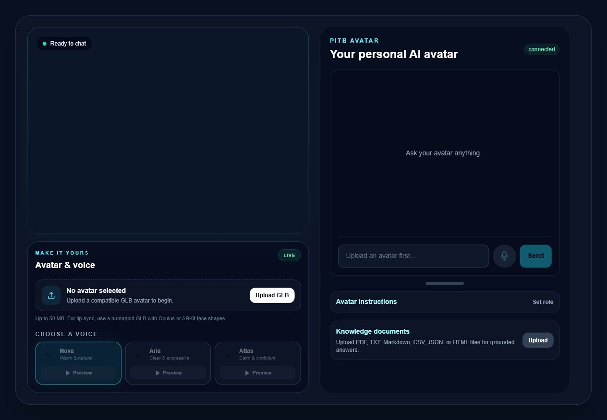
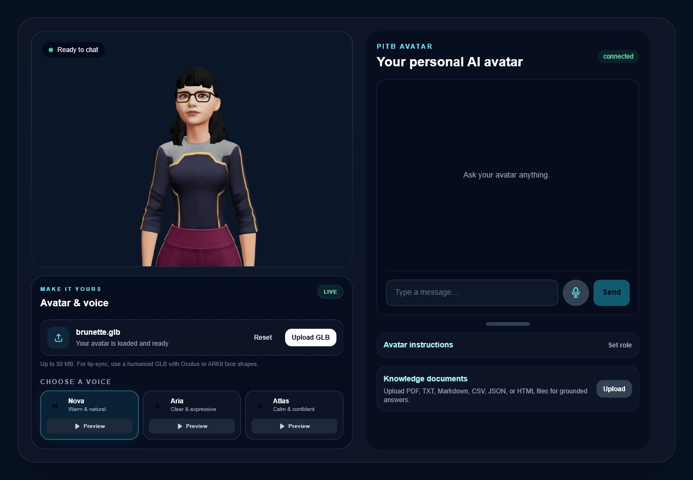
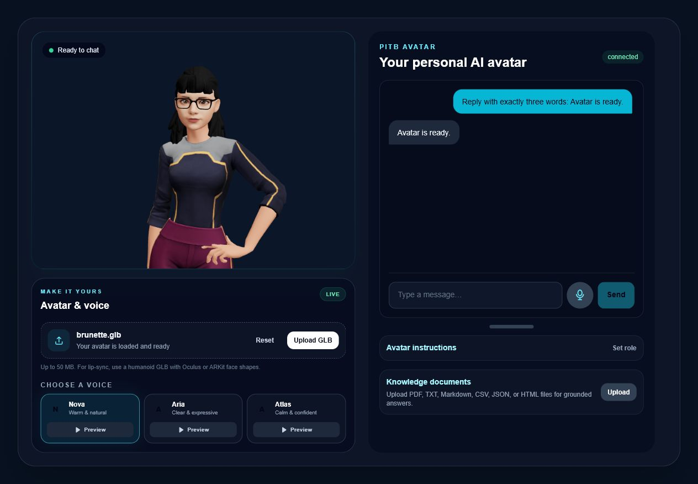
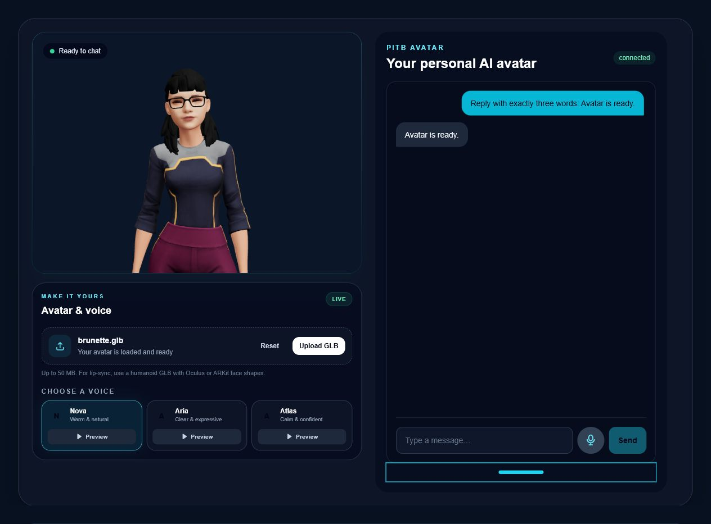
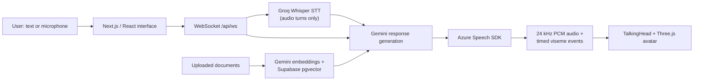

# PITB 3D Talking Avatar Assistant

A production-deployed conversational 3D avatar that accepts typed or spoken questions, answers with Gemini, speaks through Microsoft Azure voices, and animates compatible GLB facial morph targets with timed visemes.

**Live application:** [avatar-chatbot-psi.vercel.app](https://avatar-chatbot-psi.vercel.app)

**Full documentation:** [PROJECT_TECHNICAL_DOCUMENTATION.md](PROJECT_TECHNICAL_DOCUMENTATION.md)

## Final product

### Guided, user-controlled starting state

The application starts with a clear choice: select one of three ready-made avatars or upload a compatible GLB. Voice and conversation controls become active after the selected model loads.



### Compatible GLB loaded

Avatar files are validated in the browser and rendered from a temporary object URL. The GLB itself is not uploaded to the server.



### Spoken conversation with the avatar

The right-side conversation panel remains aligned with the avatar while the selected model speaks the Azure-generated response.



### Expandable conversation workspace

The horizontal handle below the conversation panel can be dragged downward to enlarge the chat and hide the system-instruction and document panels. It also supports the keyboard and remembers the selected height.



## Main capabilities

- Upload a custom `.glb` avatar up to 50 MB.
- Select one of three ready-made avatars for a quick start.
- Validate GLB 2.0 structure, humanoid skeleton nodes, skinning, facial morph targets, and required Oculus visemes before rendering.
- Guide first-time users to choose a ready-made avatar or upload their own model.
- Choose and preview three Azure voices:
  - **Nova** — `en-US-JennyNeural`
  - **Aria** — `en-US-AriaNeural`
  - **Atlas** — `en-US-GuyNeural`
- Ask questions by text or microphone.
- Transcribe microphone recordings with Groq Whisper.
- Generate grounded conversational replies with Gemini.
- Upload PDF, TXT, Markdown, CSV, JSON, or HTML documents for retrieval-augmented answers.
- Store document chunks in Supabase/pgvector in production, with a local JSON fallback for development.
- Synthesize 24 kHz speech with exact Azure viseme offsets.
- Map Azure viseme IDs to Oculus mouth shapes and schedule them against the audio timeline.
- Interrupt an active response when the user begins speaking.
- Set a custom system instruction for the active session.
- Resize the chat panel to prioritize conversation after setup is complete.
- Run locally as a split Next.js and WebSocket development environment.
- Deploy as a unified Next.js application on Vercel.

The ready-made models are pinned sample assets from the [TalkingHead demonstration repository](https://github.com/met4citizen/TalkingHead). Their original licenses apply; the included samples are intended for non-commercial demonstration unless the respective asset provider grants commercial use.

## Current architecture



The primary production implementation lives inside `frontend/`. The separate `backend/` directory contains a FastAPI implementation retained for development history and alternative-backend work.

## Local development

### Prerequisites

- Node.js 22 or newer
- npm
- Provider credentials for Gemini, Groq, and Azure Speech
- Optional Supabase/Postgres configuration for production-style RAG
- A compatible Oculus-viseme GLB for full lip-sync testing

### Configure provider variables

Copy the backend template and fill the local values:

```powershell
Copy-Item backend\.env.example backend\.env
```

Required variables:

```text
GEMINI_API_KEY
GROQ_API_KEY
AZURE_SPEECH_KEY
AZURE_SPEECH_REGION
```

Never commit `.env` files or provider values.

### Start the application

```powershell
cd frontend
npm install
npm run dev
```

Open [http://localhost:3000](http://localhost:3000).

The development launcher starts:

- Next.js on port `3000`
- the local WebSocket/voice-preview server on port `3001`

It automatically makes the frontend use `ws://localhost:3001/api/ws`.

### Optional RAG configuration

When the following variables are configured, documents use Supabase and Gemini embeddings:

```text
RAG_SUPABASE_URL
RAG_SUPABASE_SERVICE_ROLE_KEY
RAG_POSTGRES_URL_NON_POOLING
```

Without those variables, local development stores extracted chunks in:

```text
frontend/.local-data/document-chunks.json
```

The local data directory is ignored by Git.

## Validation commands

```powershell
cd frontend
npm run lint
npm exec tsc -- --noEmit
npm run build
```

Python source validation:

```powershell
backend\.venv\Scripts\python.exe -m compileall -q backend
```

## Repository structure

```text
avatar-chatbot/
├── README.md
├── PROJECT_TECHNICAL_DOCUMENTATION.md
├── AI_HANDOFF_CONTEXT.md
├── docs/
│   └── screenshots/
├── frontend/
│   ├── app/
│   ├── components/
│   ├── lib/
│   ├── scripts/
│   ├── dev.mjs
│   └── server.mjs
└── backend/
    ├── main.py
    ├── services/
    └── viseme_map.py
```

## Memory status

The assistant has **short-term session memory only**. The server retains the most recent 12 user/assistant messages in memory for the current WebSocket connection. That history is lost when the connection, tab, or server session ends.

There is **no persistent long-term conversational memory** in a database.

Uploaded document knowledge is persistent storage/RAG, not conversational memory.

## Deployment

The production application is hosted on Vercel:

[https://avatar-chatbot-psi.vercel.app](https://avatar-chatbot-psi.vercel.app)

Production provider credentials are stored as encrypted Vercel environment variables and are not part of this repository.

## Documentation maintenance

Use [PROJECT_TECHNICAL_DOCUMENTATION.md](PROJECT_TECHNICAL_DOCUMENTATION.md) as the primary project record. Future changes should add:

1. the date and objective,
2. the design decision,
3. files or services changed,
4. problems encountered,
5. verification performed,
6. deployment and rollback notes,
7. new limitations or follow-up work.
